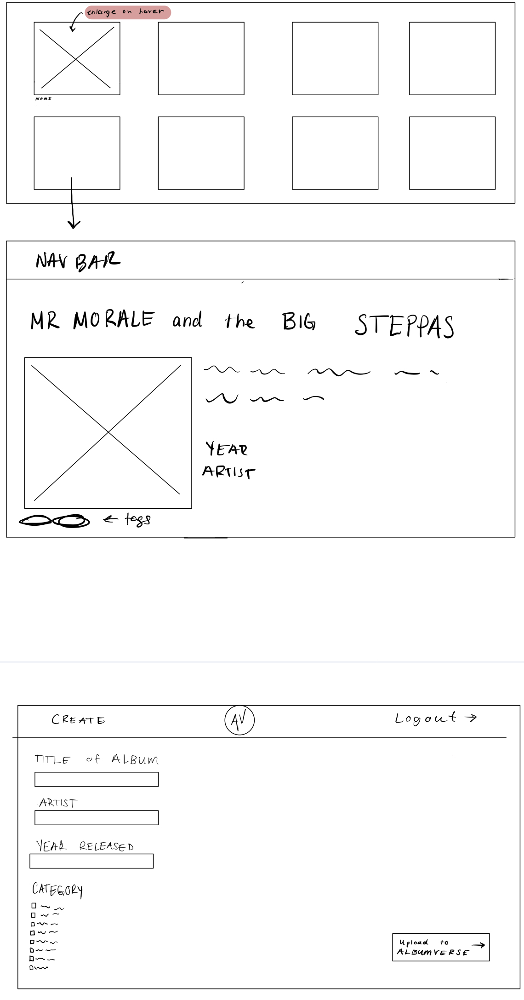

# Project 3: Design Journey

**For each milestone, complete only the sections that are labeled with that milestone.** Refine all sections before the final submission.

You are graded on your design process. If you later need to update your plan, **do not delete the original plan, rather leave it in place and append your new plan _below_ the original.** Then explain why you are changing your plan. Any time you update your plan, you're documenting your design process!

**Replace ALL _TODOs_ with your work.** (There should be no TODOs in the final submission.)

Be clear and concise in your writing. Bullets points are encouraged.

**Everything, including images, must be visible in _Markdown: Open Preview_.** If it's not visible in the Markdown preview, then we can't grade it. We also can't give you partial credit either. **Please make sure your design journey should is easy to read for the grader;** in Markdown preview the question _and_ answer should have a blank line between them.


## Design Plan (Milestone 1)

**Make the case for your decisions using concepts from class, as well as other design principles, theories, examples, and cases from outside of class (includes the design prerequisite for this course).**

You can use bullet points and lists, or full paragraphs, or a combo, whichever is appropriate. The writing should be solid draft quality.


### Catalog (Milestone 1)
> What will your catalog website be about? (1 sentence)
>
>The catalog website will be about album covers and the artist associated with them.


### _Consumer_ Audience (Milestone 1)
> Briefly explain your site's _consumer_ audience. Your audience should be specific, but not arbitrarily specific. (1 sentence)
> Justify why this audience is a **cohesive** group. (1-2 sentences)
>
> Our consumer audience are music enthusiasts and collectors. This is a cohesive audience because these are people who would enjoy looking at album covers and finding ways to encounter new ones. They all share the same common interest and have a love for music.


### _Consumer_ Audience Goals (Milestone 1)
> Document your _consumer_ audience's goals for using this catalog website.
> List each goal below. There is no specific number of goals required for this, but you need enough to do the job (Hint: It's more than 1. But probably not more than 3.)
> **Hint:** Users will be able to view all entries in the catalog. The audience's goals should probably relate to these activities.

Goal 1: Browse through various albums

- **Design Ideas and Choices** _How will you meet those goals in your design?_

  - I will meet this goal in my design by showing all the entries of albums on the main page.
  - The website will also allow them to scroll up and down and filter specific albums

- **Rationale & Additional Notes** _Justify your decisions; additional notes.

- This is a good decision because the audience will have the option to look at specfic albums they favor or look at all entries. This will help them find their preferences.


Goal 2: Know who the artist is for each album

- **Design Ideas and Choices** _How will you meet those goals in your design?
  - For this goal I will add the name of the artist on the information page of each album.

- **Rationale & Additional Notes** _Justify your decisions; additional notes._
  - This is a good idea because it can allow the audience to get infromation about the album and explore more of the artist's music.


Goal 3: Find a new genre of albums

- **Design Ideas and Choices** _How will you meet those goals in your design?
- I will implement a a genre filter so people can find a specfic one that they like.

- **Rationale & Additional Notes** _Justify your decisions; additional notes._
- This is a good implementation because every user is different, and not all of them will like to listen to the same music category. The diverse option will attract more users and satiafy them.


### _Consumer_ Audience Device (Milestone 1)
> How will your _consumer_ audience access this website? From a narrow (phone) or wide (laptop) device?
> Justify your decision. (1 sentence)
 >They will view it using a desktop. This is because it is a lot easier to scroll and filter through a website with multiple square boxes. Using a narrow screen can make the website look crowded, or make the user scroll for a longer time.


### _Consumer_ Persona (Milestone 1)
> Use the goals you identified above to develop a persona of your site's _consumer_ audience.
> Your persona must have a name and a face. The face can be a photo of a face or a drawing, etc.
>
> Name: Dominic
> 


**Factors that Influence Behavior:**
> Listens to a lot of music
> Has a hard time finding new music

**Goals:**
> Can scroll through and easily find and album that he is in the mood for

**Obstacles:**
> Doesn't like asking people for music reccomendations

**Desires:**
> The persona's desire is to easily find a new album that he is in the mood for. He does not like asking people for reccomindations because they might reccomend something he does not like. He wants to be able to easily find diffrent genres on his own based on how he is feeling.


### _Administrator_ Audience (Milestone 1)
> Briefly explain your site's _administrator_ audience. Your audience should be specific, but not arbitrarily specific. (1 sentence)
> Justify why this audience is a **cohesive** group. (1-2 sentences)
>
> The administrator audience are artists and album cover makers who create and inspire others with their art.
> This is a cohesive audience because artists and their staff both share a common interest of creating the best album from front to back. They have a shared understanding of wanting to get their album out there and making the best peice of art.


### _Administrator_ Audience Goals (Milestone 1)
> Document your _administrator_ audience's goals for using this catalog website.
> List each goal below. There is no specific number of goals required for this, but you need enough to do the job (Hint: It's more than 1. But probably not more than 3.)
> **Hint:** Users will be able to view all entries in the catalog and insert new entries into the catalog. The audience's goals should probably relate to these activities.
>

Goal 1: Submit their works to the website

- **Design Ideas and Choices** _How will you meet those goals in your design?_
  - Implement a form where they can submit the album cover they own or designed and more details about it.

- **Rationale & Additional Notes** _Justify your decisions; additional notes._
  - This is a good implementation because the adminstrators can create a community and show off their works through a simple form.

Goal 2: Delete an entry they think do not want anymore.
- **Design Ideas and Choices** _How will you meet those goals in your design?_
   - I will implement a feature where the adminstrators can hide certain or delete certain entries that other adminstrators put.

- **Rationale & Additional Notes** _Justify your decisions; additional notes._
  - This will alow the adminstrators to give curate a website that are the best and most important to be on the website.


### _Administrator_ Persona (Milestone 1)
> Use the goals you identified above to develop a persona of your site's _administrator_ audience.
> Your persona must have a name and a face. The face can be a photo of a face or a drawing, etc.
>
> Name: Sophia


**Factors that Influence Behavior:**

- Makes music
- Young artist
- Trying to get her work out into the public

**Goals:**
- Join a website where she can submit her album
- Show off her album to music enthusiasts

**Obstacles:**
- Does not have many ways to show off her album
- Wants a place where only professional artists can login and submit an album for authentification and validity of the website


**Desires:**
- Have her album become popular
- Have more people find out about her

### Catalog Data (Milestone 1)
> Using your personas, identify the data you need to include in the catalog for your site's audiences.
> Justify why this data aligns with your persona's goals. (1 sentence)
>
> - Picture of album cover
> - Name of artist
> - Year released
> - Genre of album
> - Music video of most popular song on the album
> - Nation where the music came from
>
> This data aids the persona with their goals because they can not only discover a new album, but also the artist's name. Therefor, music enthusiats will be able to sucessfully use the site and meet their goals. The adminstrators, the ones submitting their works can also gain from this as the website will also show their most popular song on the album.


### Site Design (Milestone 1)
> Design your catalog website to address the goals of your personas.
> Sketch your site's design:
>
> - These are **design** sketches, not _planning_ sketches.
> - Use text in the sketches to help us understand your design.
> - Where the content of the text is unimportant, you may use squiggly lines for text.
> - **Do not label HTML elements or annotate CSS classes.** This is not a planning sketch.
>
> Provide a brief explanation _underneath_ each sketch. (1 sentence)
> **Refer to your persona by name in each explanation.**


In this sketch I designed the login page and the main page to view all entires.
>

 In these sketched I included (1)a view of the main entries page as you scroll down (2)the detailed page of each album and (3) what the form would look like when adding a new album to the database.


### Catalog Design Patterns (Milestone 1)
> Explain how you used design patterns in your site's design. (1-2 sentences)

Some design patters I used in my site's design was the right-aligned submit button in the form. Another design pattern I used was putting the name of the album under each album to the left corner because users tend to read a website from left to right.


## Implementation Plan (Milestone 1, Milestone 2, Milestone 3, Final Submission)

### Database Schema (Milestone 1)
> Plan the structure of your database. You may use words or a picture.
> A bulleted list is probably the simplest way to do this.
> Make sure you include constraints for each field.
>
> Table: Albums

- id: INT {NN, PK, U, AI},
- title: TEXT {U, NN},
- artist: TEXT {NN},
- year: INT{NN}
- genre: INT{NN}
- description: TEXT{NN}
- nation: TEXT {NN}

> Table: genre names

- id: INT {NN, PK, U, AI},
- genre_name: TEXT {U, NN},


> Table:nation
- id: INT {NN, PK, U, AI},
- nation: TEXT {U, NN},


//Final Submission

Table: Albums

- id: INT {NN, PK, U, AI},
- title: TEXT {U, NN},
- artist: TEXT {NN},
- year: INT{NN}
- description: TEXT{NN}
- images: TEXT{NN}
- file_ext: TEXT{NN}

> Table: tags

- id: INT {NN, PK, U, AI},
- tag_name: TEXT {U, NN},


> Table: album_tags
- id: INT {NN, PK, U, AI},
- album_id: INT{U, NN},
- tag_id: INT {U, NN},


### Database Query Plan (Milestone 1, Milestone 2, Milestone 3, Final Submission)
> Plan _all_ of your database queries.
> You may use natural language, pseudocode, or SQL.

```
result = exec_sql_query($db,'SELECT * FROM album;');
$album = $result->fetchAll();

```

```
//milestone 1
home page:
$result2 = exec_sql_query(
  $db,
  "SELECT *
  FROM album_tags INNER JOIN tags ON album_tags.tag_id = tags.id WHERE album_tags.album_id = ". $id
 );

 $album2 = $result2->fetchAll();

//milestone 2
details page:
$id = $_GET['album-id'];
$result2 = exec_sql_query(
  $db,
  "SELECT *
  FROM album_tags INNER JOIN tags ON album_tags.tag_id = tags.id WHERE album_tags.album_id = ". $id
 );
 $album2 = $result2->fetchAll();

 details page:
 $result = exec_sql_query(
  $db,
  "SELECT *
  FROM album WHERE album.id = ". $id
 );
 $album = $result->fetchAll();


//milestone 3
 form page:
 $result4 = exec_sql_query(
$db,
  "INSERT INTO album (title, artist, year, description, images, file_ext) VALUES (:title, :artist, :year,  :description, :images, :file_ext);",
  array(
    ......
  )
 )

 form page:
 $result5 = exec_sql_query(
    $db,
      "INSERT INTO album_tags (album_id, tag_id) VALUES (:record_id, :tag_id);",
      array(
        ':record_id' => $record_id, // tainted
        ':tag_id' => $form_values['genre'], // tainted
        ':tag_id' => $form_values['nation']
      )
      );
      $final = $result5->fetchAll();

//final submission

```


## Complete & Polished Website (Final Submission)

### Accessibility Audit (Final Submission)
> Tell us what issues you discovered during your accessibility audit.
> What do you do to improve the accessibility of your site?

In my audit issues, I discovered that I had empty links, which was because I forgot to close my "<a>" tags. Addtionally, I found that I had color contrast issues, so I decided to change the color of my fonts so the audience can view it better.

### Self-Reflection (Final Submission)
> Reflect on what you learned during this assignment. How have you improved from Projects 1 and 2?


In Project 1, I learned the basics of PHP coding and how to echo out values. I mostly learned about variables, operators, and data types. This project provided me of a foundation for building more complex PHP applications.

In Project 2, I learned how to create a database and store data inside it using PHP and how to write SQL queries to create tables, insert data into them, and retrieve data from them. I also learned about database design principles, such as indexing.

In Project 3, I also learned how create a login and logout form using PHP and a database and to create a secure password hashing function and how to use sessions to keep a user logged in with sessions. I saw how impoertant it was to also learn about user authentication and authorization, as well as how to handle user input and error messages.


> Take some time here to reflect on how much you've learned since you started this class. It's often easy to ignore our own progress. Take a moment and think about your accomplishments in this class. Hopefully you'll recognize that you've accomplished a lot and that you should be very proud of those accomplishments! (1-3 sentences)

Overall, working on these projects improved my PHP coding skills and gave me a deeper understanding of web development concepts, such as databases, authentication, and security. I will be able to use these skills in the future to showcase my coding skills.

### Collaborators (Final Submission)
> List any persons you collaborated with on this project.


### Reference Resources (Final Submission)
> Please cite any external resources you referenced in the creation of your project.
> (i.e. W3Schools, StackOverflow, Mozilla, etc.)

W3Schools, Mozilla


### Grading: User Accounts (Final Submission)
> The graders will need to log in to your website.
> Please provide the usernames and passwords.

**Administrator User:**

- Username: kashmala
- Password: monkey

**Consumer User:**
//does not support consumer login


**Note:** Not all websites will support consumer log in. If your website doesn't, say so.


### Grading: Step-by-Step Instructions (Final Submission)
> Write step-by-step instructions for the graders.
> The project if very hard to grade if we don't understand how your site works.
> For example, you must log in before you can delete.
> For each set of instructions, assume the grader is starting from /

_View all entries:_

1. Go to the home page

_View all entries for a tag:_

1. At the top of the homepage click a tag to view entries for a specific tag.

_View a single entry's details:_

1. In the home page, click on any album to see its details

_How to insert and upload a new entry:_

1. Go to "Add to Albumverse"
2. Fill out the form and make sure to only upload ".jpeg" images

_How to delete an entry:_
//NA
